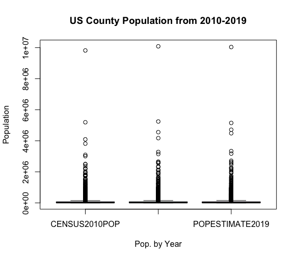
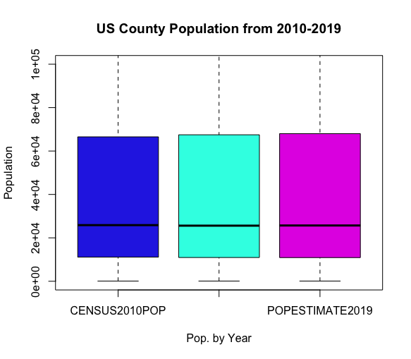
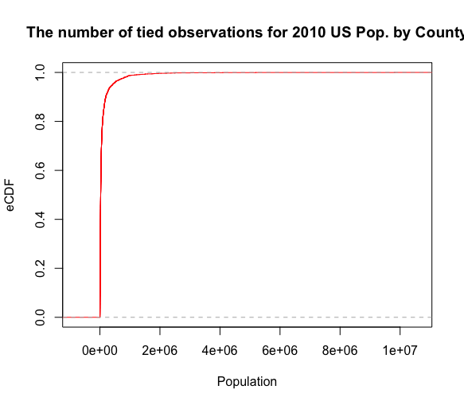
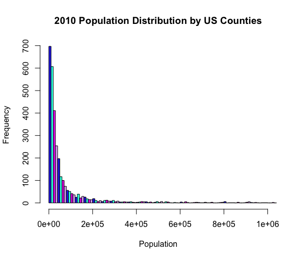
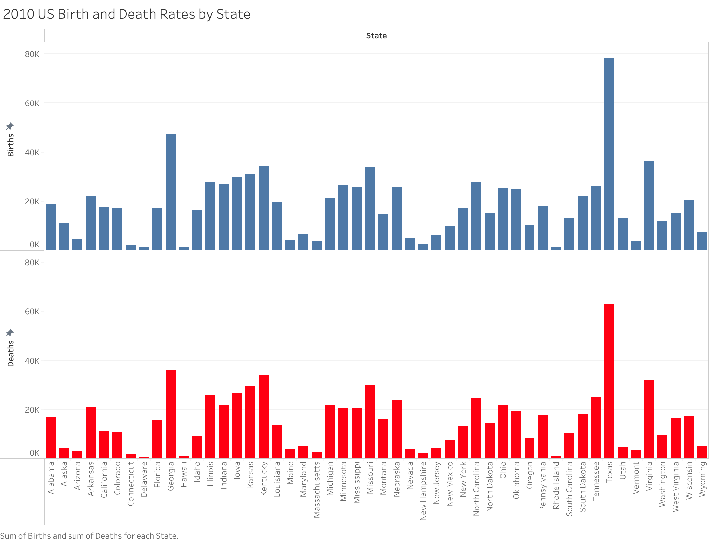
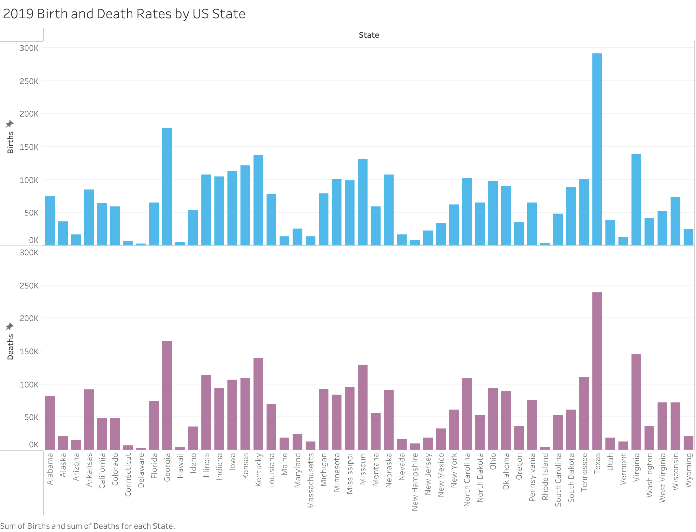

### Part 1: Create Distribution Charts

**Data Manipulation**

To begin, I downloaded the .csv file for US Census Bureau County Population dataset (CO-EST2019-alldata) and imported the file into R Studio. I made sure to set the header value to 'TRUE" in order to set the first row of the dataset as the column headers. To reference a simpler file name, US.CENSUS.COUNTY was used. The following code was used in R Studio:

    US.CENSUS.COUNTY <- read.csv("~/Downloads/co-est2019-alldata.csv", header=TRUE) #show header

Next, I noticed there were several rows where the State population was included in the columns showing County population. I removed the State Population by using the following code:

    US.CENSUS.COUNTY <- US.CENSUS.COUNTY[(US.CENSUS.COUNTY$STNAME!=US.CENSUS.COUNTY$CTYNAME), c("CTYNAME", 
    "CENSUS2010POP", "POPESTIMATE2015", "POPESTIMATE2019", "STNAME")] #exclude rows where state name = county name

In order to display the data in three separate boxplots, it is necessary to combine the columns "CENSUS2010POP", "POPESTIMATE2015" and "POPESTIMATE2019" into one column; POPULATIONYEAR. The values of each cell in this column is preserved in the column "POPULATION". The folowing code was used to combine and create new columns:

    CENSUS.DATA <- gather(US.CENSUS.COUNTY, key = "POPULATIONYEAR", value = "POPULATION", 2:4) 
    # combine 3 columns into POPULATIONYEAR and their respective values to population

Finally, in order to display eCDF and a Histogram based only on the column "CENSUS2010POP", the following modification was made to the original dataset, US.CENSUS.COUNTY:

    US.CENSUS.MOD <- US.CENSUS.COUNTY[(US.CENSUS.COUNTY$STNAME!=US.CENSUS.COUNTY$CTYNAME),
    c("CTYNAME", "CENSUS2010POP", "STNAME")] #filtered original dataset to only reflect CENSUS2010POP
    
***Additional Chart #1***

I normalized the data of birth rates by taking the total birth rates and dividing by "CENSUSPOP2010" and multiplying by 100,000. The same normalization was done for death rates where "Deaths2010" was used in the numerator in place of "BIRTHS2010".

    CENSUS.BIRTH.DEATH <- read.csv("~/Downloads/co-est2019-alldata.csv", header=TRUE)

    CENSUS.BIRTH.DEATH <- CENSUS.BIRTH.DEATH[(CENSUS.BIRTH.DEATH$STNAME!=CENSUS.BIRTH.DEATH$CTYNAME), 
    c("CTYNAME", "CENSUS2010POP", "BIRTHS2010", "DEATHS2010", "STNAME")]

The file was then imported into Tableau in order to create the idiom.

***Additional Chart #2***

I first filtered the desired rows and made sure that overlapping state totals were not included with county data. The following code was used:

    CENSUS.BD.2019 <- read.csv("~/Downloads/co-est2019-alldata.csv", header=TRUE)
    CENSUS.BD.2019 <- CENSUS.BD.2019[(CENSUS.BD.2019$STNAME!=CENSUS.BD.2019$CTYNAME), 
    c("CTYNAME","CENSUS2010POP", "POPESTIMATE2019", "BIRTHS2019", "DEATHS2019", "STNAME")]

Next, I wrote the data to file in R and exported the file to Excel for normalization of the Death and Birth data in 2019. The data was then imported into Tableau for visualization.

**Visualization Idioms**

***Boxplot without limit***

The original dataset "US.CENSUS.COUNTY" was modified into "CENSUS.DATA" as mentioned in the "Data Manipulation" section above. The boxplot function was used to visualize the data. After many attempts, I was unable to add color to the boxplot function with outliers included.

    boxplot(POPULATION~POPULATIONYEAR, data=CENSUS.DATA, col=c("#2B35E5", "#2BFFE5",   
    "#E335E5"), main="US County Population from 2010-2019", horizontal=FALSE, xlab="Pop. by 
    Year", ylab="Population")

***Boxplot with limit***

Since the boxplot's weren't displayed properly, a y-limit ("ylim") was included in the boxplot function in order to exclude outliers.

    boxplot(POPULATION~POPULATIONYEAR, data=CENSUS.DATA, col=c("#2B35E5", "#2BFFE5", "#E335E5"), 
    main="US County Population from 2010-2019", horizontal=FALSE, xlab="Pop. by Year", ylab="Population", ylim=c(0,1e05))

***Advantages/Disadvantages of Boxplot Idioms***

The advantage of visualizing the population using a box chart is being able to visualize data in the millions (1.0 x 10^6 or 1e06 in R) side by side. The disadvantage here is that you can't identify specific counties in the data. 

eCDF w/ CENSUS2010POP only

The dataset "US.CENSUS.MOD" was modified into "CENSUS.2010ONLY" as mentioned in the "Data Manipulation" section above. The eCDF function was used to visualize the data. 

    CENSUS.2010ONLY <- ecdf(US.CENSUS.MOD$CENSUS2010POP)plot(CENSUS.2010ONLY, col="red",
    xlab="Population", ylab="eCDF", main="The number of tied observations for 2010 US Pop. by County")

***Advantages/Disadvantages of eCDF***

After reviewing the calculation "i/n" of eCDF where "i" is the total observations, it seems advantageous for the Data Scientist to utilize eCDF as a tool in data cleaning. The Data Scientist is better able to identify discrepancies in the data where "ties" or repeat data occurs. This may be the case where columns are combined. The disadvantage of eCDF is that it really doesn't provide the user any information specific to the population. It's not very appealing to the eye and gives the user very little information on county populations.

***Histogram w/ "POPCENSUS2010" only***

I first plotted the histogram by using the hist function shown below along with the columns "CENSUS2010POP", "POPESTIMATE2015" and "POPESTIMATE2019". An "x-limit" along with "breaks" was included to improve visualization of the data for lower frequency populations by using the following code:

    hist(CENSUS.DATA$POPULATION, main="DID IT WORK?!",xlab="Population", ylab="", xlim=c(0,1e06), breaks = 1000)
    
Since the instructions called for using "CENSUS2010POP" only, I created a new dataset that included "CENSUS2010POP", "STNAME" and "CTYNAME" and named the dataset "US.CENSUS.MOD". The following code utilizes the hist() function which visualizes the chart in R.

    hist(US.CENSUS.MOD$CENSUS2010POP, main="2010 Population Distribution by US Counties",xlab="Population", ylab="Frequency",               xlim=c(0,1e06),col = c("#2B35E5", "#2BFFE5", "#E335E5", "#d9b1f0"), breaks = 1000)
    

***Advantages/Disadvantages of Histogram***

The advantage of the histogram in visualizing US County populations allows the user to identify the frequency in the populations of each county into samller bins. In this case, "breaks" was set to 1,000 in order to limit the y-axis range. The disadvantage to using the Histogram is similar to that pof the boxplot where the user is unable to identify data from specific Counties.

**Observations**

***Boxplot***

I noticed that the population didn't have a significant change from 2010-2019. When viewing the Boxplot without limits,I discovered that having outliers in your data may prevent R Studio from correctly displaying the visualization idiom.

***eCDF***

I observed no change in the value of the y-axis for eCDF. This seems to be a result of an undetectable "i" value (duplicates) in the current range. It is only when the line approaches an eCDF of 1.0 that it begins to increase in value. This may simply be R studio creating the perception of a curve in order to show curvature instead of a sharp line at the end of the curve.

***Histogram***

I observed that the majority of frequencies were relatively constant when the population was over 200,000 people. It is only in smaller populations that the user begins to observe increased frequencies.

### Part 2: Further Analysis

**Additional Charts**

In order to find out the current rate of deaths and births by State in 2010, I created a new dataset using "CENSUS2010POP", "BIRTHS2010" and "DEATHS2010". 

In order to find out the current rate of deaths and births by State in 2019, I created a new dataset using "POPESTIMATE2019", "BIRTHS2019" and "DEATHS2019". 

**Interesting Findings**

In the chart named "2010 US Birth and Death Rates by State", I found it interesting that most of the State's Birth and Death totals were similar to one another. It appeared to be consistent for every State except for Alaska and Utah which had a much higher birth rate.

In the chart named "2019 Birth and Death Rates by US State", the data appeared to be consistent with the 2010 data. Both Alaska and Utah proved to have significantly higher birth rates over death rates.

**Full Explanation of Analysis**

Overall, the consistent rate of births and deaths from 2010-2019 may be the result of stringent immigration policies put in place over the past decade. A higher death rate over birth rates in 2019 may be a reflection of socioeconomic hardships experienced by Americans throughout the Country which serves as an inhibiting factor when it comes to increasing family size. In future analysis, 2021 data will hopefully show a decreasing death rate due to an increase in people that are fully vaccinated for COVID 19, Haemophilus influenzae and many other vaccines offered through Primary Care Physicians.

### References
* Remove unnecessary first row in Data, https://www.google.com/search?q=r+remove+first+row&rlz=1C5CHFA_enUS864US865&oq=r+remove+first+row&aqs=chrome..69i57j0i512j0i22i30l2j0i10i22i30j0i22i30l2.3341j0j7&sourceid=chrome&ie=UTF-8
* Filter Columns in R, https://www.datanovia.com/en/lessons/select-data-frame-columns-in-r/
* , http://statseducation.com/Introduction-to-R/modules/tidy%20data/gather/
* Box Plot, https://www.statmethods.net/graphs/boxplot.html
* Histogram in R, https://www.datamentor.io/r-programming/histogram/
* eCDF, https://www.rdocumentation.org/packages/stats/versions/3.6.2/topics/ecdf
* Color in R, https://bookdown.org/rdpeng/exdata/plotting-and-color-in-r.html
* Y Axis Label in a Histogram, https://www.researchgate.net/figure/HISTOGRAMS-OF-A-CITY-POPULATIONS-AND-B-PER-CAPITA-GDP-FOR-ALL-SHUE-CITIES-AND-FOR_fig2_317775332
* eCDF Explanation, https://stat.ethz.ch/R-manual/R-devel/library/stats/html/ecdf.html
* Add Color to Bars, https://www.tutorialkart.com/r-tutorial/r-set-colors-for-bars-in-barplot/
* Add Color to Boxplots, https://www.r-graph-gallery.com/23-add-colors-to-specific-groups-of-a-boxplot.html
* Write Data to File, http://www.sthda.com/english/wiki/writing-data-from-r-to-txt-csv-files-r-base-functions
* Normalizing Data, https://github.com/odu-cs625-datavis/fall21-hw4-winstreak1
* Haemophilus influenzae, https://www.cdc.gov/hi-disease/about/index.html